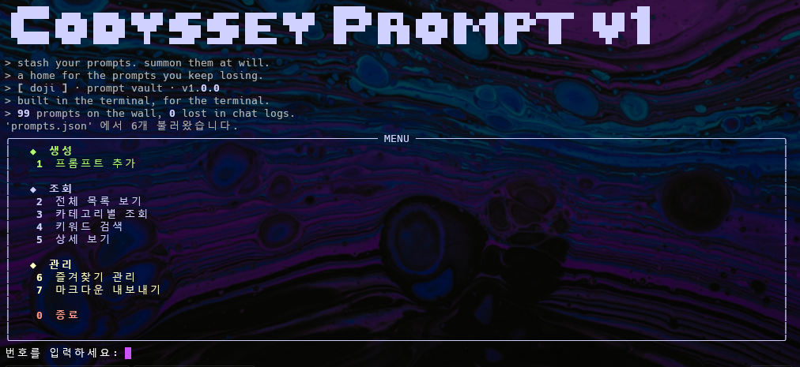

# prompt-manager

```
 ▄█████  ▄▄▄  ▄▄▄▄  ▄▄ ▄▄  ▄▄▄▄  ▄▄▄▄ ▄▄▄▄▄ ▄▄ ▄▄   █████▄ ▄▄▄▄   ▄▄▄  ▄▄   ▄▄ ▄▄▄▄ ▄▄▄▄▄▄   ▄▄ ▄▄ ▄██
 ██     ██▀██ ██▀██ ▀███▀ ███▄▄ ███▄▄ ██▄▄  ▀███▀   ██▄▄█▀ ██▄█▄ ██▀██ ██▀▄▀██ ██▄█▀  ██     ██▄██  ██
 ▀█████ ▀███▀ ████▀   █   ▄▄██▀ ▄▄██▀ ██▄▄▄   █     ██     ██ ██ ▀███▀ ██   ██ ██     ██      ▀█▀   ██
```

> stash your prompts. summon them at will.

흩어진 AI 프롬프트를 한곳에서 관리하는 터미널 기반 콘솔 프로그램입니다.
메뉴 번호를 입력해 기능을 선택하는 방식으로, 명령어나 옵션을 외울 필요 없이 사용할 수 있습니다.



---

## 빠른 시작 — 다운로드부터 실행까지

```bash
# 1. 저장소 복제
git clone https://github.com/doji-kr/prompt-manager.git
cd prompt-manager

# 2. 가상환경 생성 및 활성화
python3 -m venv .venv
source .venv/bin/activate        # Windows: .venv\Scripts\activate

# 3. 의존 패키지 설치
pip install -r requirements.txt

# 4. 실행
python3 prompt_manager.py
```

---

## 폴더 구조

```
prompt-manager/
├── prompt_manager.py   # 메인 소스 파일 (전체 로직)
├── prompts.json        # 프롬프트 저장 파일 (자동 생성)
├── prompts.md          # 마크다운 내보내기 결과 (7번 실행 시 생성)
├── requirements.txt    # 의존 패키지 목록 (rich)
├── CLAUDE.md           # Claude Code 작업 지침
└── README.md           # 이 파일
```

---

## 기능

### 생성
| 번호 | 기능 | 설명 |
|------|------|------|
| 1 | 프롬프트 추가 | 제목·내용·카테고리를 입력해 프롬프트를 저장한다. 카테고리는 목록에서 고르거나 직접 입력한다. |

### 조회
| 번호 | 기능 | 설명 |
|------|------|------|
| 2 | 전체 목록 보기 | 저장된 프롬프트 전체를 테이블로 출력한다. 즐겨찾기 항목은 ⭐로 표시된다. |
| 3 | 카테고리별 조회 | 카테고리를 선택하면 해당 카테고리의 프롬프트만 출력한다. |
| 4 | 키워드 검색 | 키워드를 입력하면 제목·내용·카테고리 세 곳을 한 번에 검색한다. 대소문자를 구분하지 않는다. |
| 5 | 상세 보기 | 번호를 입력하면 제목·카테고리·즐겨찾기 여부·내용 전체를 표시한다. |

### 관리
| 번호 | 기능 | 설명 |
|------|------|------|
| 6 | 즐겨찾기 관리 | 번호로 즐겨찾기를 추가하거나 해제한다. 즐겨찾기 목록만 모아 볼 수 있다. |
| 7 | 마크다운 내보내기 | 저장된 프롬프트 전체를 `prompts.md` 파일로 내보낸다. |

---

## 데이터 저장 방식

프로그램을 종료하면 프롬프트 목록이 `prompts.json`에 자동으로 저장되고,
다음 실행 시 자동으로 불러옵니다.

```json
[
  {
    "title": "블로그 글 작성",
    "content": "다음 주제로 블로그 글을 써줘...",
    "category": "텍스트 생성",
    "favorite": false
  }
]
```

---

## 프롬프트 카테고리

기본 제공 카테고리는 다음과 같으며, 직접 입력해 자유롭게 추가할 수 있습니다.

- 텍스트 생성
- 이미지 생성
- 영상 생성
- 페르소나
- 자동화
- 기타

---

## 기술 스택

- **언어**: Python 3
- **UI**: [rich](https://github.com/Textualize/rich) — 터미널 색상·테이블·패널
- **저장**: JSON (표준 라이브러리 `json` 모듈)
- **외부 의존성**: `rich` 외 표준 라이브러리만 사용

---

## 브랜치 구조

```
* 2d307ac (HEAD -> main) ui:colors
*   2f2f2aa Merge branch 'feature/tui'
|\
| * 784bbc7 (feature/tui) rich ui
|/
*   ff54bd8 Merge branch 'feature/make-markdown'
|\
| * 76f0822 (feature/make-markdown) markdown output
|/
* f2ed979 (feature/json-save) json
* 14cf223 favourites
* 7d96be5 categories
* 1101d07 add prompts
* ae29bb2 show contests
* 74a2c0d search
* 9fde031 dummy list
* 821d02f pm structure
* 0a64b52 init
```

| 브랜치 | 작업 내용 |
|--------|----------|
| `main` | 메모리 기반 기본 기능 → 모든 브랜치의 병합 대상 |
| `feature/json-save` | JSON 파일 자동 저장·불러오기 |
| `feature/make-markdown` | 마크다운 내보내기 (`prompts.md`) |
| `feature/tui` | rich 라이브러리 기반 터미널 UI |

---

## Git 작업 기록

프로젝트를 진행하면서 사용한 주요 Git 명령어입니다.

```bash
# 저장소 초기화 및 원격 연결
git init
git remote add origin <url>

# 변경사항 스테이징 및 커밋
git add .
git status
git commit -m "커밋 메시지"

# 원격 저장소에 올리기
git push
git push --set-upstream origin feature/json-save  # 새 브랜치 첫 푸시

# 브랜치 생성 및 이동
git checkout -b feature/json-save      # 브랜치 생성 + 이동
git checkout -b feature/make-markdown
git checkout -b feature/tui
git checkout main                      # main으로 복귀

# 브랜치 목록 확인
git branch

# 브랜치 병합 (--no-ff: 병합 커밋을 남겨 이력을 보존)
git merge --no-ff feature/make-markdown
git merge --no-ff feature/tui

# 커밋 이력 그래프로 확인
git log --oneline --graph

# 참고용 오픈소스 클론 (구조 파악 후 삭제)
git clone https://github.com/prompt-management/cli.git
```

### 커밋 이력 요약

| 커밋 | 메시지 | 내용 |
|------|--------|------|
| `0a64b52` | init | 프로젝트 초기화 |
| `821d02f` | pm structure | 메뉴 골격 구현 |
| `9fde031` | dummy list | 기본 프롬프트 데이터 3개 추가 |
| `74a2c0d` | search | 검색 기능 구현 |
| `ae29bb2` | show contests | 상세 보기 구현 |
| `1101d07` | add prompts | 프롬프트 추가 기능 구현 |
| `7d96be5` | categories | 카테고리별 조회 구현 |
| `14cf223` | favourites | 즐겨찾기 관리 구현 |
| `f2ed979` | json | JSON 저장·불러오기 (feature/json-save) |
| `76f0822` | markdown output | 마크다운 내보내기 (feature/make-markdown) |
| `784bbc7` | rich ui | rich 터미널 UI 적용 (feature/tui) |
| `2d307ac` | ui:colors | 메뉴 색상·그룹 구분 정리 |

---

crafted by [doji](mailto:dotteda@gmail.com) · it works on my machine ¯\_(ツ)_/¯
